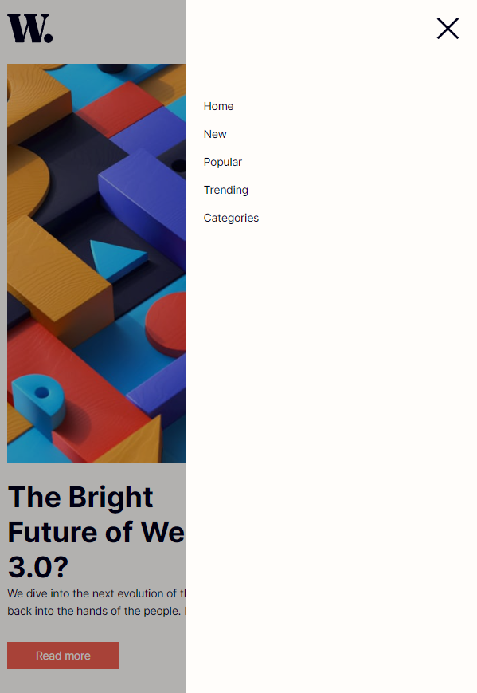

# Frontend Mentor - News homepage solution

This is a solution to the [News homepage challenge on Frontend Mentor](https://www.frontendmentor.io/challenges/news-homepage-H6SWTa1MFl). Frontend Mentor challenges help you improve your coding skills by building realistic projects. 

## Table of contents

- [Overview](#overview)
  - [The challenge](#the-challenge)
  - [Screenshot](#screenshot)
  - [My process](#my-process)
  - [Built with](#built-with)
- [Author](#author)

## Overview

### The challenge

Optimal layout for the interface depending on their device's screen size, using gulp for autmate task

### Screenshot

Mobile:

Mobile menu:

Desktop:

## My process

### Built with

- HTML5
- SCSS 
- Mobile-first workflow
- Gulp

## Author

- Website - [Add your name here](https://www.your-site.com)

